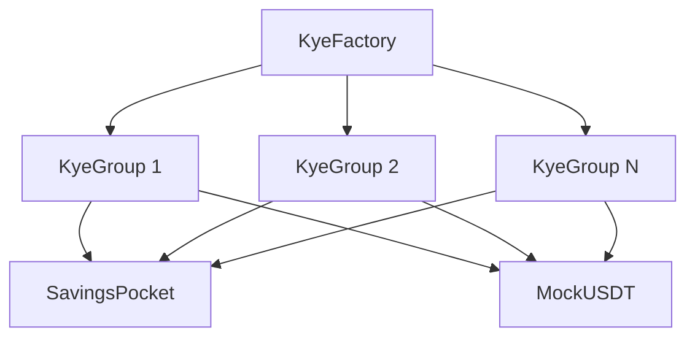

# 🤝 ROSCA "Kye" for LINE Groups on Kaia

A blockchain-based implementation of Korean rotating savings and credit associations (ROSCAs) integrated with LINE messaging platform. This project digitizes traditional "계/kye" savings circles for LINE groups, providing transparency, automated payouts, and fair penalty systems through smart contracts on the Kaia blockchain.

## 🎯 Overview

Traditional Korean savings circles (Kye/계) are trust-based community savings groups where members contribute monthly and take turns receiving the collective pot. Our dApp brings this cultural practice to the blockchain, adding transparency and automation while preserving the social trust elements.

### Key Features

- **5-member savings circles** with fixed deposit schedules
- **USDT deposits** with automated round-based payouts
- **Penalty system** for missed deposits with grace periods
- **Yield generation** through SavingsPocket adapter (5% APY)
- **LINE group integration** with invitation sharing
- **Privacy-preserving** LINE identity binding
- **Real-time notifications** and progress tracking

## 🛠 Tech Stack

### Frontend
- **Next.js 15** with App Router
- **React** with TypeScript
- **LINE LIFF** integration for LINE platform
- **Kaia Wallet SDK** for blockchain connectivity
- **React Query** for state management

### Blockchain
- **Solidity** smart contracts
- **Foundry** for development and testing
- **Kaia Blockchain** (Kairos testnet)
- **ethers.js** for contract interactions

### Smart Contracts
- **KyeFactory**: Deploys and manages circle contracts
- **KyeGroup**: Core savings circle logic with state machine
- **SavingsPocket**: Yield generation adapter
- **MockUSDT**: Testing token

## 📋 Prerequisites

- Node.js >=18.0.0 (tested with v20.18.0)
- pnpm or npm
- Git
- A Kaia-compatible wallet

## 🚀 Getting Started

### 1. Clone the Repository

```bash
git clone https://github.com/your-username/ROSCA-Kye.git
cd ROSCA-Kye
```

### 2. Install Dependencies

```bash
# Install web dependencies
cd web
pnpm install

# Install contract dependencies
cd ../contracts
npm install
```

### 3. Environment Setup

Create `.env.local` in the web directory:

```env
NODE_ENV=development
NEXT_PUBLIC_CLIENT_ID=your_sdk_client_id
NEXT_PUBLIC_CHAIN_ID=1001
CLIENT_SECRET=your_client_secret
BASE_API_URL=http://localhost:3000
NEXT_PUBLIC_LIFF_ID=your_liff_id
```

### 4. SSL Certificate Setup (Required for LINE)

```bash
# Install mkcert
brew install mkcert && brew install nss

# Create local CA
mkcert -install

# Generate certificates
mkdir cert
cd cert
mkcert -cert-file cert.pem -key-file key.pem localhost 127.0.0.1 ::1
```

### 5. Smart Contract Deployment

```bash
cd contracts

# Start local Anvil node
anvil --host 0.0.0.0 --port 8545 --chain-id 31337

# Deploy contracts locally
PRIVATE_KEY=0xac0974bec39a17e36ba4a6b4d238ff944bacb478cbed5efcae784d7bf4f2ff80 \
forge script script/Deploy.s.sol:DeployScript --rpc-url http://127.0.0.1:8545 --broadcast

# Or deploy to Kairos testnet
PRIVATE_KEY=$PRIVATE_KEY KAIA_API_KEY=$KAIA_API_KEY \
forge script script/Deploy.s.sol:DeployScript --rpc-url https://public-en-kairos.node.kaia.io --broadcast
```

### 6. Start Development Server

```bash
cd web

# Standard development (port 3000)
pnpm dev

# HTTPS development for LINE integration (port 443)
pnpm dev:https
```

## 🏗 Architecture

### Smart Contract Architecture



### Frontend Architecture

```
src/
├── app/                    # Next.js App Router
│   ├── circles/           # Circle management pages
│   ├── profile/           # User profile & wallet
│   └── api/               # API routes
├── components/            # Reusable UI components
│   ├── Bootstrap/         # LIFF initialization
│   ├── Wallet/           # Wallet connectivity
│   └── Circle/           # Circle-specific components
├── hooks/                # Custom React hooks
│   ├── useKyeContracts.ts # Smart contract integration
│   └── useLiffContext.ts  # LINE LIFF context
└── utils/                # Utilities and constants
    └── contracts/        # Contract ABIs and addresses
```

### Circle Lifecycle

1. **Setup Phase**: Creator deploys circle, invites members
2. **Active Phase**: Members make deposits, rounds progress
3. **Resolved Phase**: All rounds completed, final payouts

## 🧪 Testing

### Smart Contract Tests

```bash
cd contracts

# Run all tests
forge test

# Test specific contracts
forge test --match-contract KyeGroup
forge test --match-contract KyeFactory

# Test with verbosity
forge test -vvv
```

### Frontend Testing

```bash
cd web

# Run linting
pnpm lint

# Build for production
pnpm build
```

## 🔧 Development Commands

```bash
# Smart Contracts
forge test                 # Run contract tests
forge build               # Compile contracts
forge script script/Deploy.s.sol --broadcast  # Deploy

# Frontend
pnpm dev                  # Development server
pnpm build               # Production build
pnpm lint                # Run linting
```

## 🌐 API Endpoints

- `POST /api/circle/create` - Deploy new KyeGroup contract
- `POST /api/circle/join` - Handle member joining
- `POST /api/deposit/process` - Process USDT deposits
- `POST /api/notification/send` - Send LINE notifications
- `GET /api/yield/calculate` - Calculate SavingsPocket yields

## 🔐 Security Considerations

- LINE user IDs are hashed before storing on-chain
- All critical operations require on-chain signature verification
- Penalty calculations include maximum caps to prevent abuse
- Emergency pause mechanisms for disputed circles
- Grace period limits to prevent gaming of system

## 🤝 Cultural Context

The "kye" (계) system is deeply rooted in Korean culture as a trust-based community savings method. This blockchain implementation preserves the social trust elements while adding transparency and automation, focusing on group dynamics, fair play, and community accountability.
